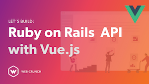

```
Roberto Nogueira  
BSd EE, MSd CE
Solution Integrator Experienced - Certified by Ericsson
```
# Tutorial Rails Api with Vue.js 



**About**

A modern course designed to help you start using and understanding Ruby on Rails fast.

[Homepage](https://www.youtube.com/watch?v=eUedqaHS4RQ&list=PLQIWx2J-GIASpN2yzAtdwoxILS7qld1XJ)

## Topics

* [ ] [01. Intro ](https://www.youtube.com/watch?v=eUedqaHS4RQ&list=PLQIWx2J-GIASpN2yzAtdwoxILS7qld1XJ&index=1)
* [ ] [02. Configuring Rails ](https://www.youtube.com/watch?v=eUedqaHS4RQ&list=PLQIWx2J-GIASpN2yzAtdwoxILS7qld1XJ&index=2)
* [ ] [03. JWTSessions Gem Setup](https://www.youtube.com/watch?v=eUedqaHS4RQ&list=PLQIWx2J-GIASpN2yzAtdwoxILS7qld1XJ&index=3)
* [ ] [04. Add Sample Data ](https://www.youtube.com/watch?v=eUedqaHS4RQ&list=PLQIWx2J-GIASpN2yzAtdwoxILS7qld1XJ&index=4)
* [ ] [05. Installing and Configuring Vue](https://www.youtube.com/watch?v=eUedqaHS4RQ&list=PLQIWx2J-GIASpN2yzAtdwoxILS7qld1XJ&index=5)
* [ ] [06. Creating our First Vue Component](https://www.youtube.com/watch?v=eUedqaHS4RQ&list=PLQIWx2J-GIASpN2yzAtdwoxILS7qld1XJ&index=6)
* [ ] [07. Artist Vue Component](https://www.youtube.com/watch?v=eUedqaHS4RQ&list=PLQIWx2J-GIASpN2yzAtdwoxILS7qld1XJ&index=7)
* [ ] [08. Final Component and Testing ](https://www.youtube.com/watch?v=eUedqaHS4RQ&list=PLQIWx2J-GIASpN2yzAtdwoxILS7qld1XJ&index=8)

